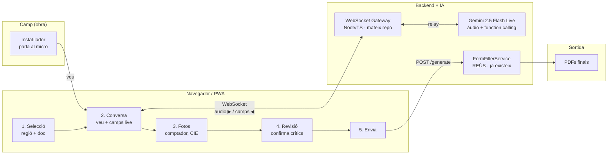

# PWA de veu per a l'instal·lador — Disseny

Branca: fusionada a `master`
Data d'inici: 2026-07-31
Estat: **veu funcionant end-to-end 2026-08-02** (§12). Pendent: connectar amb
`FormFillerService` per generar els PDFs, i qualitat de dades.

Aquest document recull totes les decisions preses durant la conversa de disseny sobre com afegir un canal de veu interactiu al projecte Sentinel, perquè l'instal·lador pugui omplir els PDFs parlant en comptes d'escriure per WhatsApp.

Serveix com a punt de partida per a la implementació posterior i com a memòria del "per què" quan es reprengui la branca.

---

## 1. Motivació

Avui el bot (`whatsapp-bot/`) omple els certificats (ELEC1, DR, Contracte, ELEC2, ELEC3, Dictamen) via missatges de text a WhatsApp. Funciona (smoke test verificat el 2026-06-09) però és lent per a l'instal·lador en obra: mans brutes, casc, sorolls, mòbil a la butxaca.

Objectiu: que l'instal·lador **parli** i que la IA transcrigui, interpreti i ompli els camps en temps real, amb confirmació abans de generar els PDFs.

## 2. Decisions preses

### 2.1 Model d'IA

**Gemini 2.5 Flash** (Live API).

Motiu: accepta àudio nativament, així que en una sola crida fem transcripció + interpretació + extracció estructurada. Elimina la necessitat d'un pas Whisper separat. Barat, i el suport de català/castellà és decent.

Alternativa considerada: Whisper + LLM (OpenAI, ja usat al bot). Descartada per complexitat del pipeline (dos serveis en comptes d'un).

### 2.2 Canal

**PWA (web app instal·lable)**, no WhatsApp per a aquest flux de veu.

Motiu: WhatsApp només permet missatges d'àudio com a fitxers, no streaming — impossible fer una conversa fluida en temps real dins WhatsApp. La PWA obre càmera, micro i WebSocket sense App Store ni Play Store.

WhatsApp es manté com a **canal secundari**: enviar el PDF final, o per instal·ladors que no volen la web.

Alternatives considerades:
- **App nativa** (Flutter/RN): més potent però manteniment doble i publicació a stores.
- **Trucada telefònica** (Twilio + Gemini Live): molt natural en obra però perd fotos i cal enviar els PDFs per un altre canal.

### 2.3 Format del schema

Valors humans en català, no codis interns.

Motiu: Gemini encerta molt més amb `"Avinguda"` que amb `"AVI"`. La traducció a codis (`APA`, `AVI`, `P1`…) es fa al backend usant el `mapping` que ja existeix a `field_map.json`.

### 2.4 Camps que requereixen confirmació obligatòria

Titular (nom, NIF), CUPS, potència **i adreça completa**.

Motiu: són els camps on un error té conseqüències legals o administratives. L'adreça es confirma com a bloc únic (`nom_via + num_via + codi_postal + municipi`) per no cansar amb un "sí" per camp.

### 2.5 Estructura dels schemes

Un fitxer compartit `_shared.json` amb `$defs` reutilitzables (`Persona`, `Emplacament`, `CUPS`, `NIF`, `CodiPostal`, `Telefon`, `Confidence`), i un schema per document que hi fa `$ref`.

Motiu: molts camps (persona titular/declarant, adreça, CUPS) apareixen a diversos documents. Un sol lloc de veritat.

`Persona` (no `Titular`) perquè el DR també té un `declarant` que és una persona diferent del titular — mateix schema, rol diferent.

`Emplacament` ampliat per cobrir tots els docs: `tipus_via`, `nom_via`, `num_via`, `bloc`, `escala`, `pis`, `porta`, `codi_postal`, `poblacio`, `comarca`, `provincia`. Camps opcionals llevat de `nom_via`, `num_via`, `poblacio`, `codi_postal`.

Nota tècnica: Gemini no resol `$ref` cross-file. Al backend s'ha de bundlejar el schema (per exemple amb `@apidevtools/json-schema-ref-parser`) abans d'enviar-lo a Gemini. `ajv` en canvi sí que hi treballa amb `addSchema(_shared)`.

### 2.6 UX de la pantalla de Conversa

- **Push-to-talk per defecte**, mode mans lliures com a toggle a Ajustaments (VAD al navegador; útil amb guants però més fals-positius).
- **Resposta parlada de Gemini**: curta i sense confirmació dada a dada. Només "anotat", "següent", etc. Vam intentar confirmació verbal per crítics (2026-08-02) però Gemini Live audio-to-audio no espera resposta i encadena la següent pregunta abans que l'usuari confirmi — resultat frustrant. La confirmació passa a la pantalla de Revisió.
- **Contorn puntejat lila 2s** sobre els camps que s'acaben d'omplir, per no perdre l'ull quan cauen diversos alhora.
- **Interrupció**: l'instal·lador pot prémer PTT mentre Gemini parla; Gemini Live suporta interrupció nativa.
- **Persistència de sessió**: el JSON parcial es desa al backend cada 5s per no perdre res si es cau la connexió.

### 2.7 Flux de confirmació i correcció (2026-08-03)

Enfoc revisat després de veure que la confirmació per veu no funcionava:

1. Gemini va anotant, respon curt (`anotat`, `següent`), no llegeix valors ni demana confirmació.
2. Quan té totes les dades importants, tanca amb frase fixa: *"Ja tinc totes les dades. Revisa-les a la pantalla i, si veus alguna cosa malament, torna aquí i digues-me què he de corregir."*
3. L'usuari obre la pantalla de Revisió: veu els camps recollits per aquest tipus de document, amb els que falten en vermell (`FALTA`) i el botó `Envia →` desactivat fins que els crítics hi siguin tots.
4. Si algun camp és incorrecte, l'usuari torna a la conversa i diu "el CUPS acaba en AC no AB". Gemini reconeix la correcció, actualitza només aquell camp i respon `Corregit, ara diu AC`. No repassa la resta.

## 3. Arquitectura



### Esdeveniments runtime

1. **Micro → Gateway** (WebSocket binari): chunks d'àudio Opus mentre l'instal·lador parla.
2. **Gateway → Gemini Live**: relay en streaming. **L'API key mai baixa al navegador.**
3. **Gemini → Gateway** (paral·lel): resposta parlada per confirmar + `tool_call` amb JSON estructurat.
4. **Gateway → PWA** (WebSocket JSON): esdeveniments `field_update` que la UI aplica al formulari lateral.
5. **PWA → Gateway** (HTTP POST en confirmar): `{ region, doc_types, fields, photos }` → `FormFillerService` retorna els PDFs.

## 4. Les 5 pantalles de la PWA

1. **Selecció** — regió (Catalunya/Aragó/…) + document (ELEC1, DR, ELEC2, Dictamen…).
2. **Conversa** — push-to-talk (millor que sempre-obert en obra sorollosa). Transcripció en directe a l'esquerra, camps que s'omplen a la dreta.
3. **Fotos** — càmera del navegador per comptador, quadre elèctric, CIE previ. Gemini també pot llegir-les.
4. **Revisió** — camps crítics destacats. Res es genera sense confirmació.
5. **Envia** — crida al `FormFillerService` existent i retorna els PDFs.

## 5. Schemes definits fins ara

### `schemas/_shared.json`

Definit amb `$defs`: `NIF`, `CUPS`, `Telefon`, `CodiPostal`, `Confidence` (enum alta/mitjana/baixa), `Persona`, `Emplacament` (ampliat: bloc, escala, pis, porta, comarca, provincia com a opcionals).

### `schemas/catalunya/elec1.schema.json`

Fa `$ref` a `Persona` (com a `titular`) i `Emplacament`. Bloc propi `instalacio` amb `cups`, `potencia_kw`, `tensio`, `material_conductor`, `ubicacio_comptadors`, `tipus_connexio`, `categoria`, `us`, `subministrament_complementari`. Bloc `_confidence` amb els camps crítics (inclosa l'adreça: `nom_via`, `num_via`, `poblacio`, `codi_postal`).

### `schemas/catalunya/dr.schema.json`

Declaració Responsable. `titular` + `declarant` (dues `Persona`), `adreca` (`Emplacament` amb `comarca`), i bloc `installacio` amb `tipus`, `camp_reglamentari`, `cups`.

### `schemas/catalunya/contracte.schema.json`

Contracte de Manteniment BT. `titular` (`Persona` + adreça planificada) i `representant` (`Persona`). Bloc `installacio` amb `adreca` (`Emplacament`), `us`, `potencia_max`, `potencia_installada`, `potencia_contractada`, `superficie`, `tensio`, `num_expedient_bt`, `empresa_comercialitzadora`, `aporta_doc`, `altres_dades`. Bloc `data` (dia/mes/any/ciutat).

### `schemas/catalunya/elec2.schema.json`

Esquema unifilar. Bloc `general` (empresa, tensio, seccio_conexio, iga, potencia_contractada, emplaçament com a string curt, titular). `circuits` és un `array` d'objectes `{ receptor, potencia, seccio, pia, diferencial }`.

Nota important: ELEC2 no és un formulari amb camps; el `FormFillerService` dibuixa text sobre la plantilla amb coordenades. **Les coordenades queden dins de `form-filler.ts`, no toquen el schema.** El schema només defineix les dades semàntiques.

### `schemas/catalunya/dictamen.schema.json`

Dictamen de Reconeixement. Bloc `general` amb dades administratives (titular, emplaçament, activitat, expedient, empresa_distribuidora, tensio, potències bàsiques i compensades). `anomalies` és un `array` d'objectes `{ id: 1..43, estat: enum, observacio }` — un ítem per cada punt d'inspecció normatiu. `estat` usa enum `["compleix", "no compleix", "no aplica"]`.

Aquest és el schema més important per a la conversa de veu: l'instal·lador pot recórrer els 43 punts en veu alta i Gemini els classifica en temps real. La UI de la pantalla de Conversa mostrarà una llista amb els 43 ítems i estat visual per cada un.

Els schemes complets són al xat de disseny; s'han de crear com a fitxers a `whatsapp-bot/src/schemas/` quan comenci la implementació.

### Estructura al disc prevista

```
whatsapp-bot/src/schemas/
  _shared.json
  catalunya/
    elec1.schema.json
    dr.schema.json
    contracte.schema.json
    elec2.schema.json
    dictamen.schema.json
  arago/
    e0001.schema.json
    ...
```

## 6. Què es reutilitza vs què es construeix

| Peça | Estat |
|------|-------|
| `FormFillerService`, `field_map.json`, plantilles PDF | Ja existeix, no es toca |
| WhatsApp com a canal | Es manté en paral·lel |
| Backend Node/TS del bot | Es reaprofita; s'hi afegeix un WebSocket Gateway |
| Gateway WebSocket + relay a Gemini Live | Nou |
| PWA (React/Vue/vanilla + service worker + manifest) | Nou |
| Schemes JSON per document | Nou (un per doc + `_shared.json`) |
| `mapHumanToPdfCodes(json, fieldMap)` | Nou (funció fina de traducció) |

## 7. Consideracions operatives

- **Cua asíncrona** (com apunta `low_cost_scaling_guide.md`): la generació de PDFs no ha de bloquejar la conversa. BullMQ o cua sobre SQLite.
- **Cost estimat**: Gemini Flash àudio + text, negligible per al volum previst (600 usuaris a `low_cost_scaling_guide.md`).
- **Persistència de la sessió**: si l'instal·lador perd cobertura, ha de poder reprendre la conversa on l'ha deixat. Cal desar el JSON parcial al backend.
- **Idiomes**: català i castellà obligatoris. Gemini gestiona el codi-switch dins la mateixa frase.

## 8. Pendents de disseny (ordre acordat)

1. ~~**Pantalla de Conversa**~~ — tancat, decisions a §2.6.
2. ~~**Schemes per DR, Contracte, ELEC2, Dictamen**~~ — dissenyats. Detall a §5. Pendent escriure'ls a `whatsapp-bot/src/schemas/`.
3. **Definir el JSON schema per Aragó, Madrid, València** — pròxim pas.
4. **Escriure els schemes a disc + `mapHumanToPdfCodes(json, fieldMap)`** — implementació.
5. **Gateway WebSocket + relay Gemini Live** — implementació.
6. **Skeleton de la PWA** — implementació.

## 9. Preguntes obertes

- Framework de la PWA: React (més ecosistema) vs Vue (més compacte) vs vanilla + Web Components (mínima dependència). Encara no decidit.
- Autenticació de l'instal·lador: sessió simple per token, o login amb Google/email?
- On es desplega la PWA i el gateway: mateix VPS Hetzner que apunta la guia d'escalat, o servei separat?

## 10. Referències internes

- [`PROJECT_STATUS_2026-06-09.md`](PROJECT_STATUS_2026-06-09.md) — estat del bot abans d'aquesta branca.
- [`MAPPING_STATUS.md`](MAPPING_STATUS.md) — quins PDFs estan mapejats per comunitat.
- [`low_cost_scaling_guide.md.resolved`](low_cost_scaling_guide.md.resolved) — pla d'escalat (SQLite, Docker, cues, Hetzner) al qual encaixa aquest disseny.
- [`field_map.json`](field_map.json) — mapping de codis interns per ELEC1 Catalunya, base per a la traducció valor humà → codi PDF.
- [`AI_STUDIO_TEST_ELEC1.md`](AI_STUDIO_TEST_ELEC1.md) — protocol de validació manual del concepte al playground de Google AI Studio.
- [`ai-studio-bundles/elec1.functions.json`](ai-studio-bundles/elec1.functions.json) — declaració de funció bundlejada llesta per enganxar al playground.

## 11. Validació del concepte (2026-08-01)

Prova feta al playground **Real-time** de Google AI Studio.

- Model: `gemini-3.1-flash-live-preview`.
- Veu: Zephyr.
- Configuració clau: `Function calling` ON, `Automatic Function Response` ON, `Thinking level` no-Minimal.
- Script: [`AI_STUDIO_TEST_ELEC1.md`](AI_STUDIO_TEST_ELEC1.md), frases 1-5.

Resultat: totes les crides a `save_elec1_fields` van retornar un JSON estructuralment vàlid amb tots els camps esperats. Els punts crítics (NIF, CUPS, potència, adreça) van sortir tots amb `_confidence: "alta"`. La conversió d'unitats (5750 W → 5.75 kW) va funcionar. La correcció al vol del CUPS (afegir prefix "ES") i del cognom (Garcia amb G) va aplicar-se sense duplicar camps.

**Tres matisos detectats a tenir en compte a la implementació:**

1. **Normalització d'ortografia**: Gemini va escriure "García" amb accent castellà tot i que l'usuari va dir "Garcia" en català. Cal decidir política a `mapHumanToPdfCodes`: respectar el que ha dit l'instal·lador o normalitzar segons la llengua del formulari.
2. **Ordinals**: "3r 2a" va sortir com "Tercer" / "Segona". Si el PDF vol la forma abreujada ("3r", "2a"), ho farà el mapper.
3. **Confirmació verbal dels camps crítics**: el system prompt actual no és prou emfàtic. Per a producció, canviar les instruccions perquè Gemini repeteixi valor + "correcte?" per titular, NIF, CUPS, potència i adreça.

Cap dels tres és bloquejant per començar a implementar.

## 12. Veu funcionant end-to-end a la PWA (2026-08-02)

Primera conversa completa per veu des de la PWA: micròfon → gateway → Gemini
Live → `toolCall` → camps a pantalla, amb Gemini confirmant en veu.

### El paràmetre que ho desbloqueja: `thinkingConfig`

Durant hores el gateway rebia àudio i Gemini responia parlant perfectament,
però **no emetia mai `toolCall`**. Es van descartar per diagnòstic: format
d'àudio (16 kHz OK), nivell del micròfon (pic 0.5 OK), buffering de chunks,
`audioStreamEnd`, `toolConfig`, i dos models alternatius.

La causa era que **el gateway no configurava `thinkingConfig`**. A AI Studio
això és el desplegable "Thinking level": amb `Minimal` el model no crida mai
la funció; en pujar-lo comença a fer-ho. El SDK ho exposa a
`LiveConnectConfig.thinkingConfig.thinkingLevel`
(`MINIMAL` | `LOW` | `MEDIUM` | `HIGH`).

```ts
thinkingConfig: { thinkingLevel: ThinkingLevel.HIGH }
```

Configurable amb `GEMINI_THINKING_LEVEL` al `.env`.

**Lliçó de procés**: teníem una configuració validada manualment i ens en vam
allunyar (prompt simplificat, models alternatius, STT del navegador) en comptes
de replicar-la camp a camp. Davant d'una referència que funciona, replicar-la
exactament primer i divergir després, d'un paràmetre a la vegada.

### Camí descartat: Web Speech API del navegador

Es va provar transcriure al navegador i enviar text al gateway. Amb `ca-ES`,
Chrome transcriu "el titular és 46789012M" com **"curs en genèric quatre sis
secuineu-los"**. Inservible per a dictat tècnic amb DNIs i CUPS. L'àudio va
directe a Gemini, que sí que ho entén.

L'input de text es manté a la UI com a fallback manual.

### Configuració que funciona

| Paràmetre | Valor |
|---|---|
| Model | `gemini-3.1-flash-live-preview` |
| `responseModalities` | `[AUDIO]` (TEXT fa timeout al connect) |
| `thinkingConfig.thinkingLevel` | `HIGH` |
| `speechConfig` veu | `Zephyr` |
| `inputAudioTranscription` | `{}` |
| `outputAudioTranscription` | `{}` |
| Resposta al `toolCall` | `sendToolResponse` immediat |
| Àudio d'entrada | PCM 16 kHz mono, chunks ~100 ms |
| Àudio de sortida | PCM 24 kHz mono, encadenat a `pwa/src/audio/player.ts` |

### Qualitat de dades observada

Primera conversa real, dient "Joan Garcia Puig", adreça i CUPS:

```json
{
  "titular": { "nom_complet": "Juan García Puig", "nif": "46789012M" },
  "instalacio": { "cups": "ES0031405221001234AB", "potencia_kw": 5.75,
                  "tensio": "230 V", "us": "Instal·lacions d'habitatges" },
  "emplacament": { "nom_via": "Diagonal", "num_via": "340",
                   "codi_postal": "08037", "poblacio": "Barcelona" }
}
```

Correcte: NIF, CUPS sencer, potència, tensió, ús mapejat a l'enum.

**Dos problemes de qualitat pendents:**

1. **Castellanització de noms catalans**: "Joan Garcia" → "Juan García". Més
   greu que el matís de §11 (allà només era l'accent). Cal reforçar el system
   prompt perquè respecti la grafia catalana dels noms propis, i possiblement
   validar contra el DNI.
2. **`emplacament` incomplet**: falten `tipus_via` ("Avinguda"), `pis` ("3r") i
   `porta` ("2a") tot i haver-los dit. Són opcionals a l'schema, així que
   valida igual i la pèrdua passa desapercebuda. Cal insistir-hi al prompt o
   fer que la pantalla de Revisió els demani explícitament.
